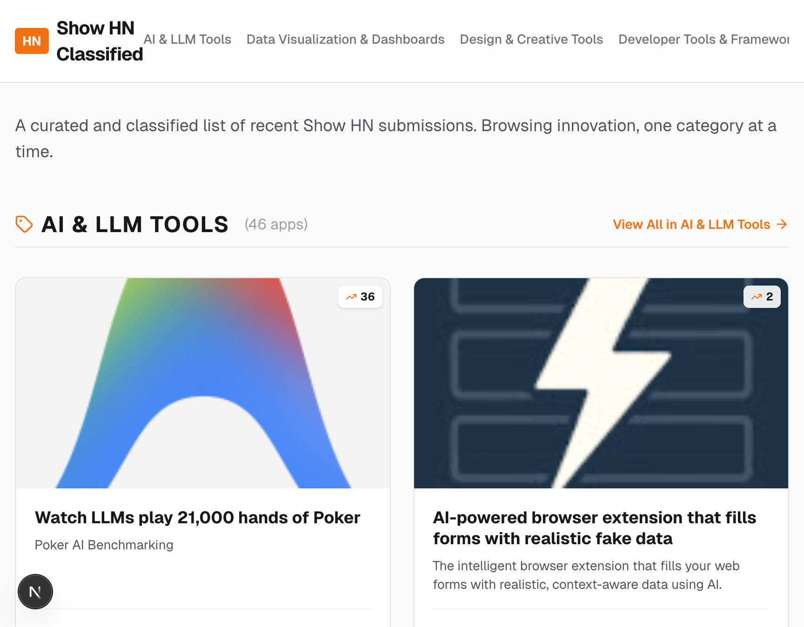

# Show HN Classified

A curated and automatically classified directory of apps submitted to Hacker News. This project solves the problem of "Show HN" posts quickly dropping to the bottom of the list by categorizing them into meaningful sections with rich metadata.



## 🚀 How it Works

The application operates in three main stages:

1.  **Scraping**: Fetches the latest posts from `https://news.ycombinator.com/show` and `https://news.ycombinator.com/shownew`. It follows the external links to each app's landing page or GitHub repository.
2.  **Metadata Extraction**: Uses `metascraper` and custom logic to pull the best possible titles, descriptions, and images. For GitHub repositories, it deep-scans README files to find actual screenshots instead of generic social previews.
3.  **Classification**: Automatically categorizes each app using a keyword-based engine that analyzes the title and extracted metadata. Apps are then sorted by the number of comments to highlight the most discussed projects.

## 📋 Features

- **Categorized Browsing**: Quickly find apps in domains like AI, Developer Tools, Games, Data Visualization, and more.
- **Rich Previews**: Each app card shows a high-quality screenshot, detailed description, and engagement metrics (score/comments).
- **Direct Links**: Easy access to both the live application and the original Hacker News discussion.
- **Dynamic Routing**: Dedicated pages for each category for focused browsing.

## 🛠️ Getting Started

### Prerequisites

- Node.js (Latest LTS recommended)
- npm

### Installation

```bash
npm install
```

### Refreshing Data

To pull the latest 1,000+ apps from Hacker News and re-classify them:

```bash
npm run scrape
```

### Development

Start the Next.js development server:

```bash
npm run dev
```

## 📄 Origin

This project was built based on the [original prompt](./starting-prompt.txt).

> "Create an app that reads hacker news submitted apps and classifies them... The result should be a series of pages that show a category name followed by a list of apps showing the image, title, and description along with the original link."

## 🚀 Deployment

The app is designed to be deployed on **Vercel**. All classified data is saved statically in the `./data` directory, allowing for lightning-fast performance and SEO-friendly pages.
